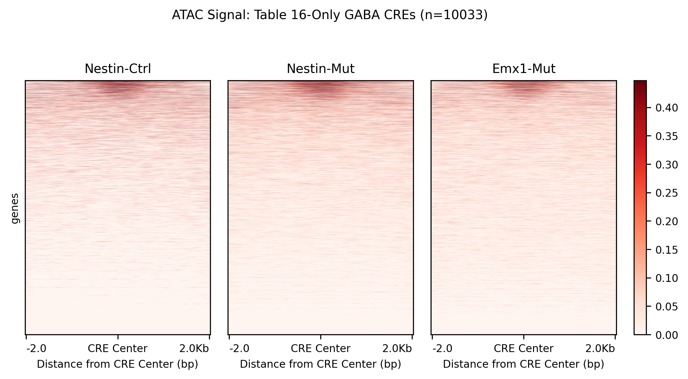
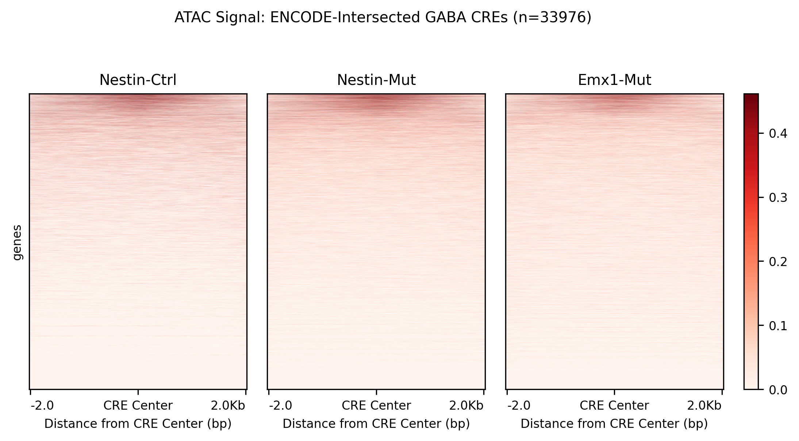
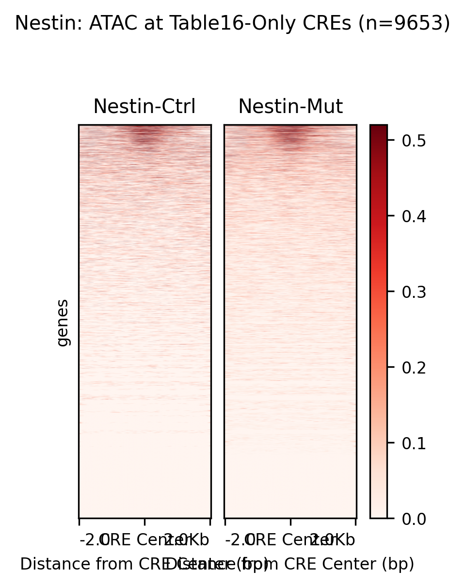
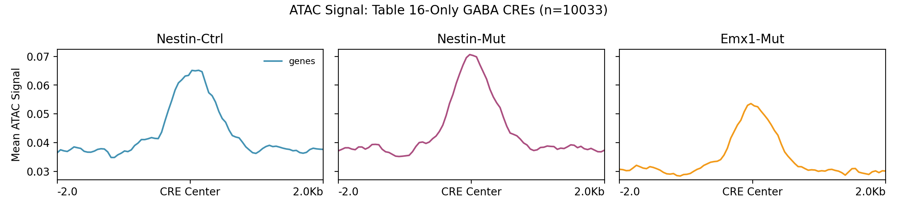
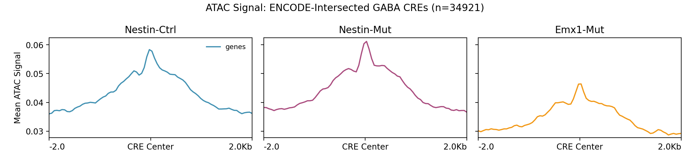

# GABA Cell Type Specific ENCODE cCREs Analysis Pipeline

- Focuses on **GABA-specific** regulatory elements
- Links CREs to genes using **Table 16** (literature correlations)

> **CRITICAL**: Emx1-Ctrl is a **FAILED SAMPLE** and is excluded from all analyses.
> Only 3 conditions are analyzed: **Nestin-Ctrl** (reference control), **Nestin-Mut**, and **Emx1-Mut**.

## Pipeline Stepsatures

- **Enhanced GABA SubType Filtering**: Uses keyword matching to identify GABA-specific CREs
- **Dual Output Strategy**: Creates BOTH Table 16-only AND ENCODE-intersected CRE sets
- **minSig/minFC Filtering**: Visualizes only significantly differentially accessible CREs
- **Publication-Ready Outputs**: Heatmaps, metaprofiles, and individual CRE plots

## Two CRE Output Sets

This pipeline produces **TWO complementary CRE sets**:

| CRE Set | Description | Use Case |
|---------|-------------|----------|
| **Table 16-Only** | All GABA-specific CREs from Table 16 coordinates | Maximum coverage |
| **ENCODE-Intersected** | Table 16 CREs that overlap with mm10-cCREs.bed | High-confidence validated |

### When to Use Each Set

- **Table 16-Only**: Use for maximum coverage analysis when you want ALL GABA-specific regulatory regions
- **ENCODE-Intersected**: Use when you need high-confidence CREs validated by the ENCODE consortium

## Pipeline Overview

The pipeline consists of four main stages:

1. **Extract GABA-Specific CREs** (`1_extract_GABA_encode_cCREs.py`)
   - Filters Table 16 for GABA cell type SubTypes
   - Creates Table 16-only output (all GABA CREs)
   - Intersects with ENCODE mm10-cCREs.bed using bedtools
   - Applies statistical filters: FDR < 0.05, |PCC| > 0.2
   - Reports overlap statistics

2. **Convert to BED Format** (`2_convert_to_bed.py`)
   - Creates BED6 format files for BOTH CRE sets
   - Generates type-specific BED files (dELS, pELS, etc.) for intersected CREs

3. **Create Heatmaps** (`3_create_heatmaps.sh`)
   - Uses deepTools for visualization
   - Creates analyses for BOTH Table 16-only AND ENCODE-intersected CREs
   - Creates genotype-specific analyses (Nestin/Emx1)

4. **Visualize DA CREs** (`4_visualize_DA_CREs.py`)
   - Filters for significant differential accessibility
   - Creates metaprofiles and individual CRE plots
   - Applies minSig/minFC thresholds

## Data Sources

### Primary Data Files

| File | Used? | Purpose |
|------|-------|---------|
| **mm10-cCREs.bed** | **YES** | ENCODE cCREs (~340,000 regions) |
| **table_16.txt** | **YES** | Literature CRE-gene correlations with SubType info |

**mm10-cCREs.bed** (ENCODE cCREs):
- Path: `../data/mm10-cCREs.bed`
- Content: ~340,000 candidate cis-regulatory elements
- Usage: Target regions for bedtools intersection

**table_16.txt** (Literature CRE-Gene Correlations):
- Path: `../data/table_16.txt`
- Content: 3,256,804 published CRE-gene correlations
- Usage: Source of GABA SubType information
- Statistical filters: FDR < 0.05, |PCC| > 0.2

### GABA SubType Keywords (Enhanced)

The pipeline uses comprehensive keyword matching for GABA cell types:

| Category | Keywords |
|----------|----------|
| **Hippocampal Regions** | CA1, CA2, CA3, CA4, DG, DGNBL, HPF, Hippocampus |
| **GABA Markers** | GABA, GABAergic, INH, Interneuron, Inhibitory |
| **Interneuron Types** | PV, PVALB, SST, Sst, VIP, Vip, LAMP5, LAMP, SNCG |
| **Combined Markers** | PVGA, SSTGA, VIPGA, LAMGA, NBLGA |
| **Granule Cells** | GRC, GC, Granule |
| **Neuroblasts** | NB |

## CRE Filtering Criteria

| Filter | Value | Applied? |
|--------|-------|----------|
| **FDR threshold** | < 0.05 | YES |
| **PCC threshold** | > 0.2 | YES |
| **SubType filter** | GABA keywords | YES |
| **ENCODE intersection** | bedtools | For intersected set only |

## minSig/minFC Filtering

The visualization step (Step 4) filters for significant differential accessibility:

| Parameter | Python Default | Shell Default | Description |
|-----------|----------------|---------------|-------------|
| **min_signal** | 2.0 | 2.0 | Minimum max signal required across conditions |
| **min_fc** | 2.0 | 2.0 | Minimum fold change (FC >= X OR FC <= 1/X) |

**Note**: The complete pipeline (`0_RUN_COMPLETE_PIPELINE.sh`) runs BOTH threshold sets:
1. First with `2.0/2.0` (lenient)
2. Then with `3.0/2.0` (strict)

## Running the Pipeline

### Complete Pipeline
```bash
sbatch 0_RUN_COMPLETE_PIPELINE.sh
```

### Individual Steps
```bash
# Step 1: Extract GABA-specific CREs (requires sc-chromatin2 for bedtools)
sbatch 1_extract_GABA_encode_cCREs.sh

# Step 2: Convert to BED format
sbatch 2_convert_to_bed.sh

# Step 3: Create heatmaps
sbatch 3_create_heatmaps.sh

# Step 4: Visualize DA CREs (defaults: minSig=2.0, minFC=2.0)
sbatch 4_visualize_DA_CREs.sh

# Step 4 with lenient filtering
MIN_SIGNAL=1.0 MIN_FC=1.5 sbatch 4_visualize_DA_CREs.sh

# Step 4 fast mode (metaprofiles only)
SKIP_INDIVIDUAL=1 sbatch 4_visualize_DA_CREs.sh
```

## Output Structure

```
output/
├── GABA_specific_table16_cCREs.tsv      # Table 16-only CRE-gene links
├── GABA_specific_table16_cCREs.bed      # Table 16-only BED format
├── GABA_specific_encode_cCREs.tsv       # ENCODE-intersected CRE-gene links
├── GABA_specific_encode_cCREs_by_type.tsv # Same data with CRE type info
├── GABA_specific_encode_cCREs.bed       # ENCODE-intersected BED format
├── GABA_specific_encode_cCREs_{type}.bed # Type-specific BED files
├── SUMMARY_GABA_specific_cCREs.txt      # Extraction summary with overlap stats
├── heatmaps_deeptools/
│   ├── # TABLE 16-ONLY CREs
│   ├── heatmap_table16_only.png
│   ├── metaprofile_table16_only.png
│   ├── heatmap_table16_only_nestin.png
│   ├── metaprofile_table16_only_nestin.png
│   ├── heatmap_table16_only_emx1.png
│   ├── metaprofile_table16_only_emx1.png
│   ├── # ENCODE-INTERSECTED CREs
│   ├── heatmap_GABA_specific.png
│   ├── metaprofile_GABA_specific.png
│   ├── heatmap_GABA_specific_nestin.png
│   ├── metaprofile_GABA_specific_nestin.png
│   ├── heatmap_GABA_specific_emx1.png  # Nestin-Ctrl vs Emx1-Mut
│   ├── matrix_GABA_specific.gz/.tab
│   ├── matrix_GABA_specific_nestin.gz/.tab
│   ├── matrix_GABA_specific_emx1.gz/.tab
│   ├── heatmap_GABA_specific_{type}.png
│   └── README.txt
├── DA_profiles_minSig1.0_minFC1.5/      # DA visualization (lenient thresholds)
│   ├── metaprofile_nestin_ctrl_vs_mut_all.png
│   ├── metaprofile_nestin_ctrl_vs_emx1_mut_all.png
│   ├── metaprofile_nestin_mut_vs_emx1_mut_all.png
│   ├── DA_statistics.txt
│   └── profiles/
│       └── individual_*.png
└── DA_profiles_minSig2.0_minFC2.0/      # DA visualization (strict thresholds)
    ├── metaprofile_nestin_ctrl_vs_mut_all.png
    ├── metaprofile_nestin_ctrl_vs_emx1_mut_all.png
    ├── metaprofile_nestin_mut_vs_emx1_mut_all.png
    ├── DA_statistics.txt
    └── profiles/
        └── individual_*.png
```

## Overlap Statistics

The pipeline reports overlap statistics between Table 16 and ENCODE:

```
OVERLAP STATISTICS
================================================================================
  Table 16 unique regions: X,XXX
  Regions with ENCODE overlap: X,XXX (XX.X%)
  Regions WITHOUT ENCODE overlap: X,XXX
```

This helps you understand:
- How many GABA CREs are validated by ENCODE
- How many are Table 16-only (literature-derived)

## Comparison with Other Pipelines

| Feature | CREs_encode_paper_intersection | CREs_encode_GABA_specific (This) |
|---------|-------------------------------|----------------------------------|
| **Focus** | All cell types + GABA subset | GABA-specific only |
| **Gene Filter** | Splicing genes | None (all GABA) |
| **SubType Keywords** | Basic (12 keywords) | Enhanced (30+ keywords) |
| **minSig/minFC** | Not included | Included |
| **Individual Plots** | Limited | Full support |
| **Dual Output** | No | **YES (Table 16 + Intersected)** |

## Generated Plots

### Heatmaps (deepTools)

#### Table 16-Only CREs

- **Use for**: Maximum coverage analysis
- **Expected**: Strong red signal throughout
- **Interpretation**: ATAC accessibility at ALL GABA-specific regulatory elements

#### ENCODE-Intersected CREs

- **Use for**: High-confidence validated CREs
- **Expected**: Strong red signal throughout
- **Interpretation**: ATAC accessibility at ENCODE-validated GABA regulatory elements

#### Genotype-Specific Heatmaps

**Nestin Genotype (Table 16-only):**


**Emx1 Genotype (Table 16-only):**


### Metaprofiles

#### Table 16-Only CREs

- **Use for**: Maximum coverage analysis
- **Expected**: High curves with peak at CRE center

#### ENCODE-Intersected CREs

- **Use for**: High-confidence validated CREs
- **Expected**: High curves with peak at CRE center

### DA Visualization

The pipeline generates:
1. **Metaprofiles for all CREs**: Overview of signal across all GABA-specific CREs
2. **Metaprofiles for significant CREs**: Only CREs passing minSig/minFC thresholds
3. **Individual CRE plots**: Per-CRE visualization for top significant CREs

## Parameters

| Parameter | Value |
|-----------|-------|
| Window size | ±2000 bp around CRE center |
| Bin size | 50 bp |
| Sorting | By mean signal (descending) |
| Processing | Parallel with deepTools (16 CPUs) |

## Conda Environments

| Step | Environment | Required Tools |
|------|-------------|----------------|
| Step 1: Extraction | `sc-chromatin2` | bedtools, pandas, numpy |
| Step 2: BED conversion | `rna_seq_analysis_deep` | pandas |
| Step 3: Heatmaps | `rna_seq_analysis_deep` | deepTools |
| Step 4: DA Visualization | `rna_seq_analysis_deep` | pandas, numpy, matplotlib |