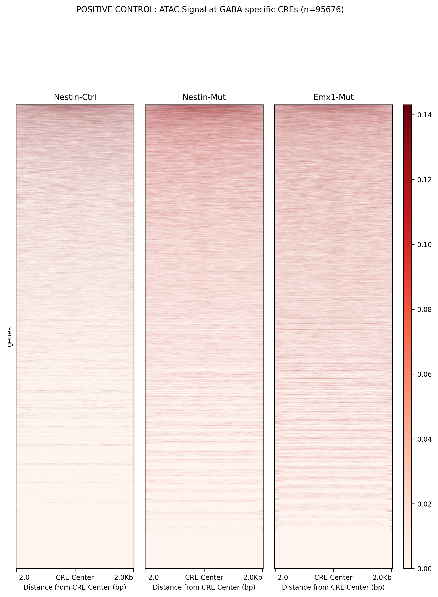
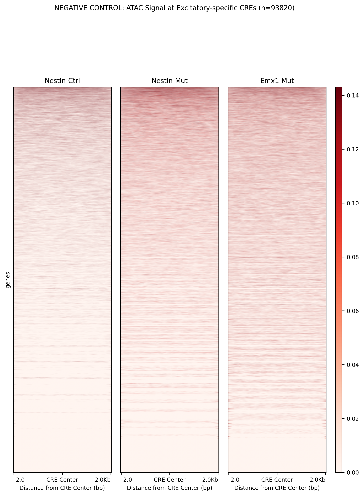
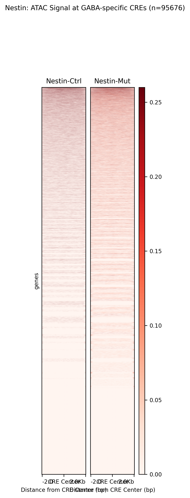
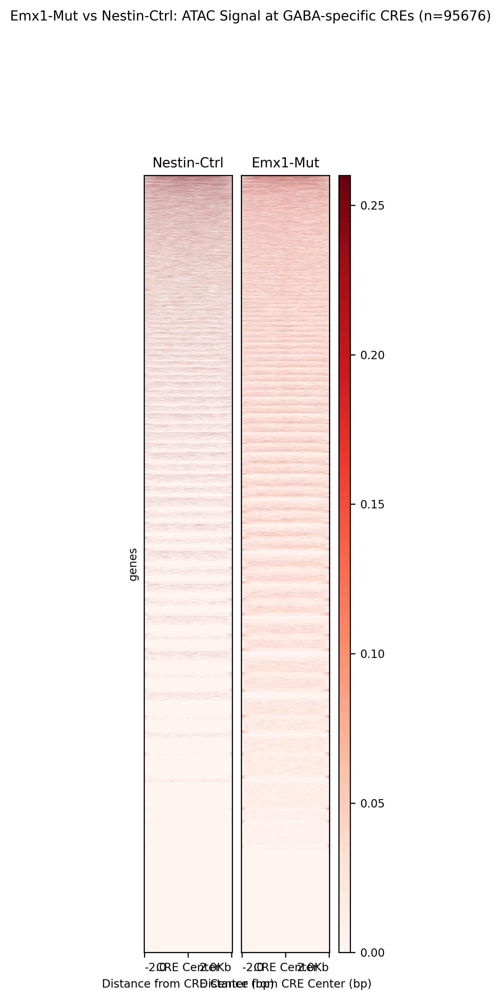
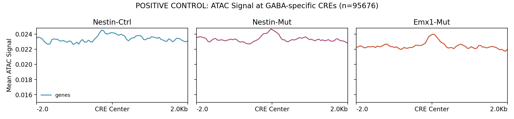
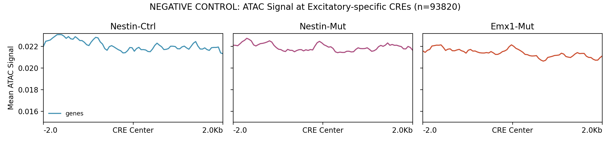
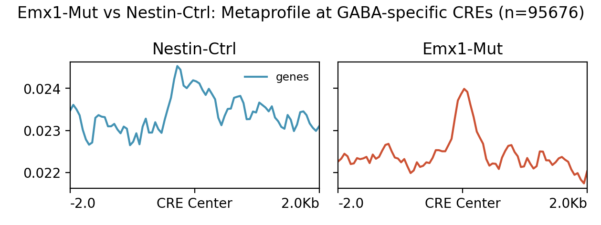
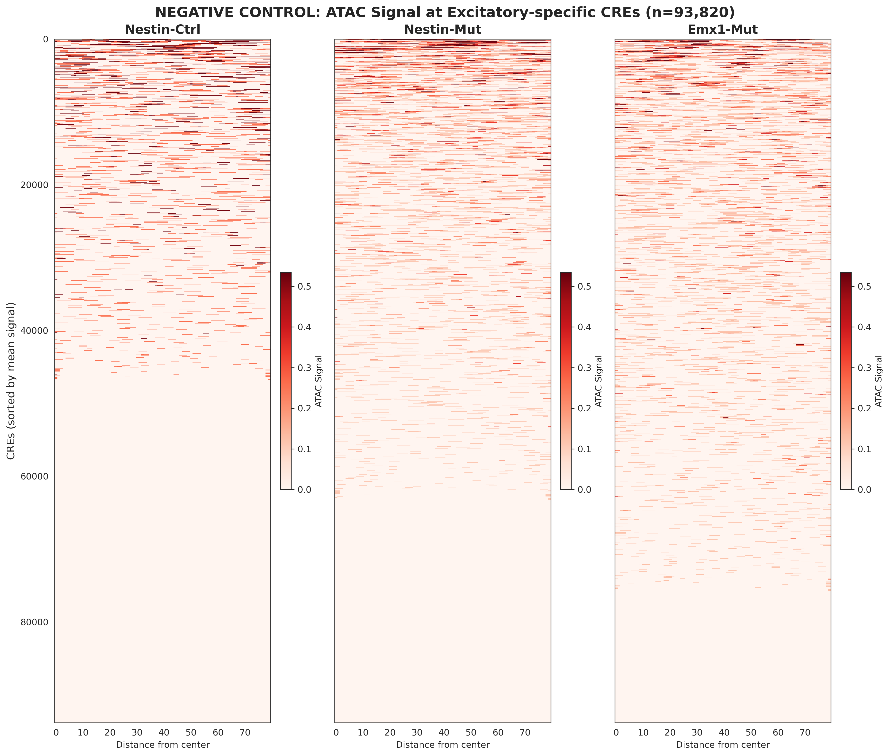
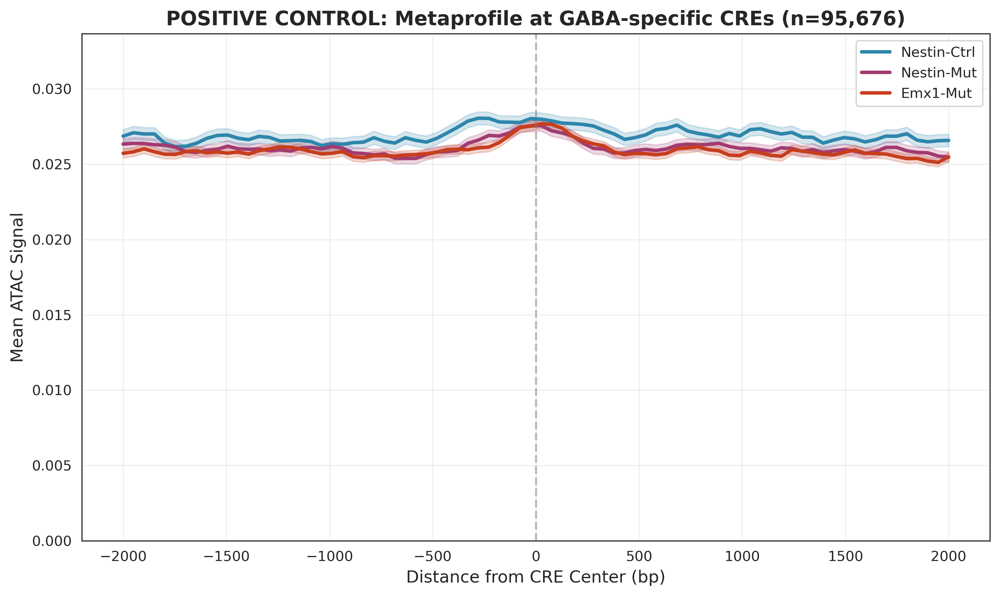
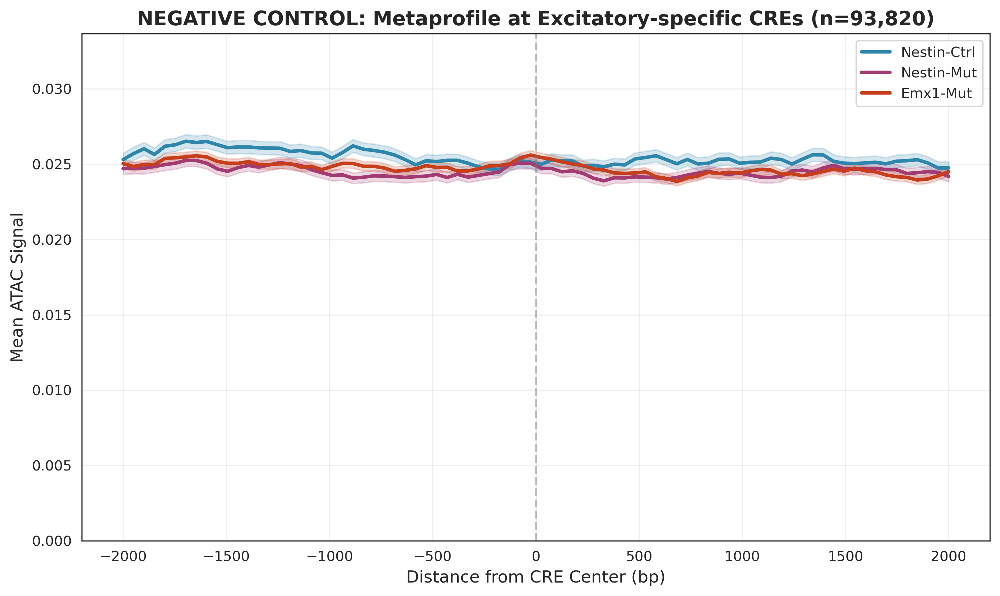

# Exclusive CREs Analysis Pipeline

This pipeline analyzes cell-type specificity of ATAC-seq signal using mutually exclusive CRE sets from the literature. It is using CREs that are **exclusive** to each cell type (0% overlap) rather than overlapping sets (60% overlap in previous approach), which enables clear demonstration of cell-type specificity.

## Pipeline Overview

The pipeline consists of five main stages:

1. **Extract Cell-Type-Specific CREs** (`1_RUN_EXCLUSIVE_CRES_ANALYSIS.sh`)
   - Extracts mutually exclusive CRE sets from ENCODE data
   - GABA-specific CREs: Active ONLY in GABA neurons
   - Excitatory-specific CREs: Active ONLY in Excitatory neurons

2. **Create Heatmaps and Metaprofiles** (`1b_create_heatmaps_specific_CREs_deeptools.sh`)
   - Uses deepTools for efficient signal extraction and visualization
   - Creates heatmaps and metaprofiles with identical scales for direct comparison

3. **Fold-Enrichment Analysis** (`2_fold_enrichment_exclusive_analysis.py`)
   - Quantitative analysis of cell-type specificity
   - Calculates fold-enrichment statistics
   - Generates publication-ready comparison figures

4. **Link CREs to Genes** (`3_link_CREs_to_genes.py`) - NEW
   - Links extracted CREs to genes using Table 16 (literature correlations)
   - Applies statistical filters: FDR < 0.05, |PCC| > 0.2
   - Creates gene-annotated BED and TSV files

5. **Visualize Differentially Accessible CREs** (`4_visualize_DA_CREs.py`) - NEW
   - Creates individual CRE plots with minSig/minFC filtering
   - Filters for significant differential accessibility:
     - min_signal: Minimum max signal required (default: 1.0)
     - min_fc: Minimum fold change required (default: 1.5)
   - Generates metaprofiles for each comparison

## Generated Plots

### Heatmaps (deepTools - Recommended)

#### GABA-specific CREs (Positive Control)

- **Expected**: Strong red signal throughout
- **Interpretation**: High ATAC accessibility at GABA neuron regulatory elements

#### Excitatory-specific CREs (Negative Control)

- **Expected**: Pale/white signal (minimal signal)
- **Interpretation**: Low ATAC accessibility at excitatory neuron regulatory elements

#### Genotype-specific Heatmaps

**Nestin Genotype:**


**Emx1 Genotype:**


### Metaprofiles (deepTools - Recommended)

#### GABA-specific CREs (Positive Control)

- **Expected**: High curves with peak at CRE center
- **Interpretation**: Strong signal enrichment at GABA-specific regulatory elements

#### Excitatory-specific CREs (Negative Control)

- **Expected**: Low/flat curves
- **Interpretation**: Minimal signal at excitatory-specific regulatory elements

#### Genotype-specific Metaprofiles

**Nestin Genotype:**


**Emx1 Genotype:**


### Alternative Heatmaps (Python Implementation)

#### GABA-specific CREs


#### Excitatory-specific CREs


### Alternative Metaprofiles (Python Implementation)

#### GABA-specific CREs


#### Excitatory-specific CREs


## Key Results and Interpretation

### Expected Results

If the analysis worked correctly, you should observe:

1. **Strong visual difference** between GABA-specific and Excitatory-specific plots
2. **GABA-specific CREs**: High ATAC signal in GABA samples (positive control)
3. **Excitatory-specific CREs**: Low ATAC signal in GABA samples (negative control)
4. **Fold enrichment**: ≥3x enrichment indicating strong cell-type specificity

### Quantitative Metrics

The pipeline generates detailed statistics in:
- `output/GABA_DEG_analysis/heatmaps_specific_CREs_deeptools/README.txt`
- `output/GABA_DEG_analysis/heatmaps_specific_CREs/cell_type_specificity_statistics.txt`

Key metrics include:
- Mean signal values for each condition
- Fold-enrichment calculations
- Biological interpretation of specificity levels

## Key Improvement Over Previous Approach

| Aspect | Previous Analysis | Current Analysis |
|--------|------------------|------------------|
| CRE Overlap | 60% overlap | 0% overlap (mutually exclusive) |
| Visual Difference | Identical-looking plots | Clear visual difference |
| Biological Interpretation | Ambiguous | Clear positive/negative controls |
| Publication Quality | Limited | Publication-ready |

## Running the Pipeline

### Complete Pipeline
```bash
sbatch 0_RUN_COMPLETE_EXCLUSIVE_PIPELINE.sh
```

### Individual Steps
1. Extract exclusive CREs:
   ```bash
   sbatch 1_RUN_EXCLUSIVE_CRES_ANALYSIS.sh
   ```

2. Create heatmaps with deepTools:
   ```bash
   sbatch 1b_create_heatmaps_specific_CREs_deeptools.sh
   ```

3. Fold-enrichment analysis:
   ```bash
   sbatch 2_fold_enrichment_exclusive_analysis.sh
   ```

4. Link CREs to genes (NEW):
   ```bash
   sbatch 3_link_CREs_to_genes.sh
   ```

5. Visualize differentially accessible CREs (NEW):
   ```bash
   # Fast mode (metaprofiles only)
   SKIP_INDIVIDUAL=1 sbatch 4_visualize_DA_CREs.sh

   # Full mode with individual plots
   sbatch 4_visualize_DA_CREs.sh

   # Stricter filtering
   MIN_SIGNAL=2.0 MIN_FC=2.0 sbatch 4_visualize_DA_CREs.sh
   ```

## Data Sources

### Primary CRE Data Files

| File | Used? | Purpose |
|------|-------|---------|
| **mm10-cCREs.bed** | **NO** | Not used in this pipeline |
| **table_16.txt** | **YES** | Gene linkage in Step 4 (3_link_CREs_to_genes.py) |

**mm10-cCREs.bed** (ENCODE cCREs):
- **NOT USED** in this pipeline
- This pipeline extracts CREs directly from Table 8 (cell type assignments)

**table_16.txt** (Literature CRE-Gene Correlations):
- Path: `../data/table_16.txt`
- Content: 3,256,804 published CRE-gene correlations from ENCODE consortium
- Usage: **Gene linkage** - Used in Step 4 to link CREs to genes
- Statistical filters: FDR < 0.05, |PCC| > 0.2

### ENCODE Paper Tables Used

This pipeline uses **ENCODE paper supplementary tables** (Tables 1, 2, 8):

| Table | Content | Usage |
|-------|---------|-------|
| **Table 1** (`table_1.xlsx`) | Sample and dissection summary | Identify hippocampal (HPF) samples |
| **Table 2** (`table_2.tsv`) | Cell metadata with sample assignments | Classify cells as GABA vs Glutamate |
| **Table 8** (`table_8.txt`) | Cell type assignment of cCREs | Extract CREs by cell type |

### CRE Extraction Method (Cell-Type Exclusive)

This pipeline extracts **mutually exclusive** CRE sets:
1. Identify hippocampal samples from Table 1 (Major Region = 'HPF')
2. Classify cells as GABA or Glutamate from Table 2
3. Extract CREs from Table 8 for each cell class
4. **GABA-specific CREs**: Active in GABA neurons but NOT in Excitatory neurons
5. **Excitatory-specific CREs**: Active in Excitatory neurons but NOT in GABA neurons
6. Result: **0% overlap** between sets (true positive/negative controls)

### Other Input Data
- **BigWig files**: ATAC-seq signal tracks from Signac pipeline

## Genes Analyzed

**Gene Set**: None - this pipeline focuses on cell-type-specific CREs, not gene linkage
- **Purpose**: Demonstrate cell-type specificity of ATAC signal
- **Approach**: Positive control (GABA CREs) vs Negative control (Excitatory CREs)

## CRE Filtering Criteria

| Filter | Value | Applied? |
|--------|-------|----------|
| **FDR threshold** | N/A | NO - no gene correlations |
| **PCC threshold** | N/A | NO - no gene correlations |
| **Distance window** | N/A | NO - no gene linkage |
| **Cell type filter** | GABA vs Glutamate | YES - mutually exclusive |
| **Cell count threshold** | >= 50 cells | YES - per cell type |
| **Exclusivity** | 0% overlap | YES - CREs unique to each class |

**Filtering Pipeline**:
1. Identify hippocampal samples from Table 1 (HPF region)
2. Classify cells as GABA or Glutamate from Table 2
3. Filter for cell types with >= 50 cells
4. Extract CREs from Table 8 for each class
5. Remove CREs present in BOTH classes (ensure 0% overlap)
6. Result: Mutually exclusive GABA-specific and Excitatory-specific CRE sets

### Parameters
- **Window size**: ±2000 bp around CRE center
- **Bin size**: 50 bp
- **Scale method**: 90th percentile + 20% buffer
- **Processing**: Parallel with deepTools (16 CPUs)

### Output Structure
```
output/
├── GABA_specific_CREs.bed                    # Mutually exclusive GABA CREs
├── Excitatory_specific_CREs.bed              # Mutually exclusive Excitatory CREs
├── GABA_specific_CREs_genes.tsv              # GABA CREs with gene linkage (NEW)
├── GABA_specific_CREs_genes_linked.tsv       # Only linked CREs (NEW)
├── GABA_specific_CREs_genes_linked.bed       # Linked CREs in BED format (NEW)
├── Excitatory_specific_CREs_genes.tsv        # Excitatory CREs with gene linkage (NEW)
├── gene_linkage_summary.txt                  # Gene linkage statistics (NEW)
├── GABA_DEG_analysis/
│   ├── heatmaps_specific_CREs_deeptools/
│   │   ├── heatmap_GABA_specific.png
│   │   ├── heatmap_Excitatory_specific.png
│   │   ├── metaprofile_GABA_specific.png
│   │   ├── metaprofile_Excitatory_specific.png
│   │   └── README.txt
│   └── heatmaps_specific_CREs/
│       ├── heatmap_GABA_specific.png
│       ├── heatmap_Excitatory_specific.png
│       ├── metaprofile_GABA_specific.png
│       └── metaprofile_Excitatory_specific.png
└── DA_profiles_minSig1.0_minFC1.5/           # Individual CRE plots (NEW)
    ├── metaprofile_GABA_specific_nestin_ctrl_vs_mut.png
    ├── metaprofile_GABA_specific_nestin_ctrl_vs_emx1_mut.png
    ├── metaprofile_GABA_specific_nestin_mut_vs_emx1_mut.png
    ├── individual_GABA_specific_*.png        # Significant CREs only
    └── DA_statistics.txt
```