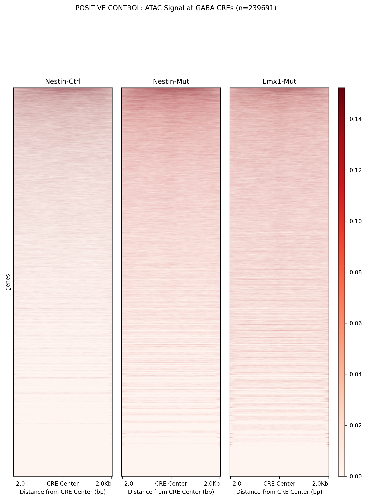
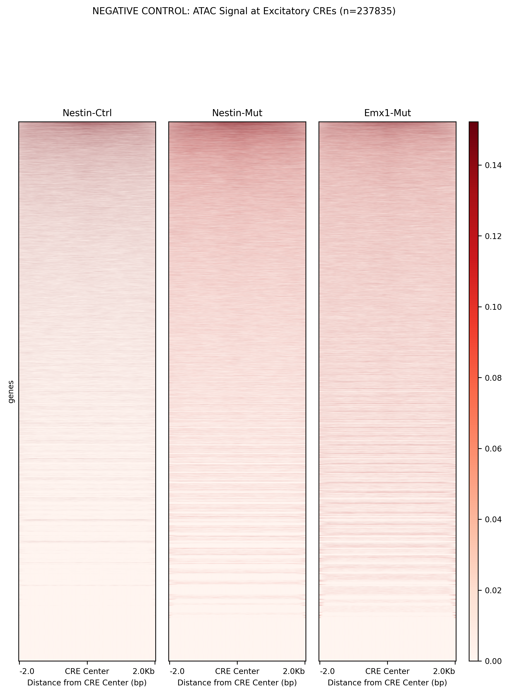
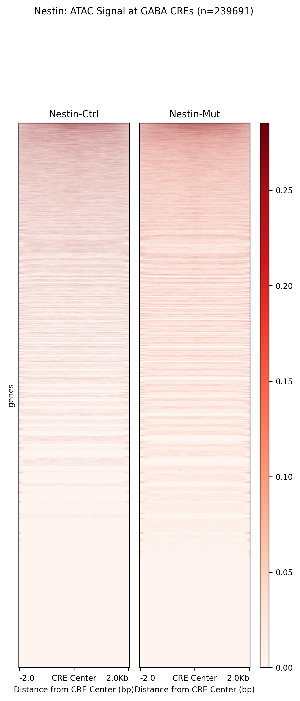
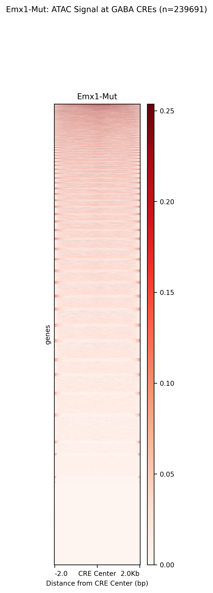
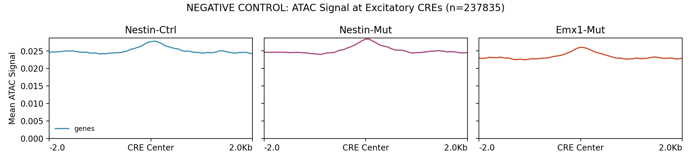
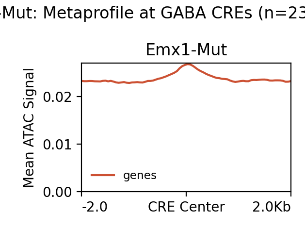

# Specific CREs Analysis Pipeline (OLD Workflow)

This pipeline analyzes cell-type specificity of ATAC-seq signal using CRE sets from literature. **This is the OLD workflow** that uses overlapping CRE sets (60% overlap) rather than mutually exclusive CREs.

## ⚠️ Important Note

This is the **OLD workflow** with limitations:
- **60% overlap** between GABA and Excitatory CRE sets
- Results in **similar-looking plots** (limited visual difference)
- Cannot demonstrate true cell-type specificity

For the **NEW workflow** with mutually exclusive CREs (0% overlap), see:
- `../Exclusive_CREs/README.md`
- `../Exclusive_CREs/1_RUN_EXCLUSIVE_CRES_ANALYSIS.sh`

## Pipeline Overview

The pipeline consists of seven main stages:

1. **Extract Hippocampal Interneuron CREs** (`1_extract_hippocampal_interneuron_CREs.py`)
   - Extracts CREs active in GABAergic interneurons from hippocampal samples
   - Conservative approach: ≥50 cells per cell type (97% coverage)

2. **Extract Excitatory Neuron CREs** (`2a_extract_excitatory_neuron_CREs.py`)
   - Extracts CREs active in glutamatergic neurons
   - Used as negative control for GABA ATAC signal

3. **Create Heatmaps and Metaprofiles** (`2b_create_heatmaps_deeptools.sh`)
   - Uses deepTools for efficient signal extraction and visualization
   - Creates heatmaps and metaprofiles for both CRE sets

4. **Fold-Enrichment Analysis** (`3_fold_enrichment_specific_analysis.py`)
   - Quantitative comparison of signal between CRE sets
   - Calculates fold-enrichment statistics

5. **Additional Comparisons** (`4_compare_GABA_vs_Excitatory.py` and `5_create_heatmaps_metaprofiles.py`)
   - Alternative visualization approaches
   - Genotype-specific analyses

6. **Link CREs to Genes** (`6_link_CREs_to_genes.py`) - NEW
   - Links extracted CREs to genes using Table 16 (literature correlations)
   - Applies statistical filters: FDR < 0.05, |PCC| > 0.2
   - Creates gene-annotated BED and TSV files

7. **Visualize Differentially Accessible CREs** (`7_visualize_DA_CREs.py`) - NEW
   - Creates individual CRE plots with minSig/minFC filtering
   - Filters for significant differential accessibility:
     - min_signal: Minimum max signal required (default: 1.0)
     - min_fc: Minimum fold change required (default: 1.5)
   - Generates metaprofiles for each comparison

## Generated Plots

### Heatmaps (deepTools)

#### GABA CREs (Positive Control)

- **Expected**: Strong red signal throughout
- **Interpretation**: High ATAC accessibility at GABA neuron regulatory elements

#### Excitatory CREs (Negative Control)

- **Expected**: Similar signal to GABA (due to 60% overlap)
- **Interpretation**: Many regulatory elements are shared between cell types

#### Genotype-specific Heatmaps

**Nestin Genotype:**


**Emx1 Genotype:**


### Metaprofiles (deepTools)

#### GABA CREs Metaprofile

- **Expected**: High curves with peak at CRE center
- **Interpretation**: Strong signal enrichment at GABA regulatory elements

#### Excitatory CREs Metaprofile

- **Expected**: Similar curves to GABA (due to overlap)
- **Interpretation**: Shared regulatory elements show similar accessibility

#### Genotype-specific Metaprofiles

**Nestin Genotype:**


**Emx1 Genotype:**


### Alternative Visualizations (Python Implementation)

#### Additional Heatmaps and Metaprofiles
The pipeline also generates alternative visualizations using Python implementation:
- Heatmaps with different clustering and sorting approaches
- Metaprofiles by signal patterns
- Genotype-specific comparisons (Ctrl vs Mut)

## Key Results and Interpretation

### Expected Results

Due to **60% overlap** between CRE sets:

1. **Similar visual appearance** between GABA and Excitatory plots
2. **High signal in both** CRE sets (shared regulatory elements)
3. **Low fold-enrichment** (typically <2x)
4. **Limited cell-type specificity** demonstration

### Quantitative Metrics

The pipeline generates detailed statistics in:
- `output/GABA_DEG_analysis/heatmaps_deeptools/README.txt`
- `output/GABA_DEG_analysis/heatmaps_deeptools/fold_enrichment_statistics_OLD.txt`

Key metrics include:
- Mean signal values for each condition
- Fold-enrichment calculations
- Biological interpretation of specificity levels

## Comparison with New Workflow

| Aspect | OLD Workflow (This) | NEW Workflow (Exclusive) |
|--------|------------------------|--------------------------|
| CRE Overlap | 60% overlap | 0% overlap (mutually exclusive) |
| Visual Difference | Minimal (similar plots) | Clear (different plots) |
| Biological Interpretation | Limited specificity | Strong specificity |
| Publication Quality | Challenging | Excellent |

## Running Pipeline

### Complete Pipeline
```bash
sbatch 0_RUN_COMPLETE_SPECIFIC_PIPELINE.sh
```

### Individual Steps
1. Extract hippocampal interneuron CREs:
   ```bash
   sbatch 1_extract_hippocampal_interneuron_CREs.sh
   ```

2. Run complete analysis (includes excitatory extraction and heatmaps):
   ```bash
   sbatch 2_RUN_SPECIFIC_CRES_ANALYSIS.sh
   ```

3. Fold-enrichment analysis:
   ```bash
   sbatch 3_fold_enrichment_specific_analysis.sh
   ```

4. Alternative comparisons:
   ```bash
   sbatch 4_compare_GABA_vs_Excitatory.sh
   sbatch 5_create_heatmaps_metaprofiles.sh
   ```

5. Link CREs to genes (NEW):
   ```bash
   sbatch 6_link_CREs_to_genes.sh
   ```

6. Visualize differentially accessible CREs (NEW):
   ```bash
   # Fast mode (metaprofiles only)
   SKIP_INDIVIDUAL=1 sbatch 7_visualize_DA_CREs.sh

   # Full mode with individual plots
   sbatch 7_visualize_DA_CREs.sh

   # Stricter filtering
   MIN_SIGNAL=2.0 MIN_FC=2.0 sbatch 7_visualize_DA_CREs.sh
   ```

## Data Sources

### Primary CRE Data Files

| File | Used? | Purpose |
|------|-------|---------|
| **mm10-cCREs.bed** | **NO** | Not used in this pipeline |
| **table_16.txt** | **YES** | Gene linkage in Step 6 (6_link_CREs_to_genes.py) |

**mm10-cCREs.bed** (ENCODE cCREs):
- **NOT USED** in this pipeline
- This pipeline extracts CREs directly from Table 8 (cell type assignments)

**table_16.txt** (Literature CRE-Gene Correlations):
- Path: `../data/table_16.txt`
- Content: 3,256,804 published CRE-gene correlations from ENCODE consortium
- Usage: **Gene linkage** - Used in Step 6 to link CREs to genes
- Statistical filters: FDR < 0.05, |PCC| > 0.2

### ENCODE Paper Tables Used

This pipeline uses **ENCODE paper supplementary tables** (Tables 1, 2, 8):

| Table | Content | Usage |
|-------|---------|-------|
| **Table 1** (`table_1.xlsx`) | Sample and dissection summary | Identify hippocampal (HPF) samples |
| **Table 2** (`table_2.tsv`) | Cell metadata with sample assignments | Classify cells as GABA vs Glutamate |
| **Table 8** (`table_8.txt`) | Cell type assignment of cCREs | Extract CREs by cell type |

### CRE Extraction Method (Cell-Type Overlapping)

This pipeline extracts CRE sets that **allow overlap** (OLD workflow):
1. Identify hippocampal samples from Table 1 (Major Region = 'HPF')
2. Classify cells as GABA or Glutamate from Table 2
3. Extract CREs from Table 8 for each cell class
4. **GABA CREs**: Active in GABA neurons (may also be active in Excitatory)
5. **Excitatory CREs**: Active in Excitatory neurons (may also be active in GABA)
6. Result: **~60% overlap** between sets (limited as negative control)

**NOTE**: For mutually exclusive CREs (0% overlap), see `CREs_paper_exclusive/`

### Other Input Data
- **BigWig files**: ATAC-seq signal tracks from Signac pipeline

## Genes Analyzed

**Gene Set**: None - this pipeline focuses on cell-type-specific CREs, not gene linkage
- **Purpose**: Demonstrate ATAC signal at cell-type CREs (with overlap allowed)
- **Approach**: GABA CREs vs Excitatory CREs (OLD workflow with ~60% overlap)

## CRE Filtering Criteria

| Filter | Value | Applied? |
|--------|-------|----------|
| **FDR threshold** | N/A | NO - no gene correlations |
| **PCC threshold** | N/A | NO - no gene correlations |
| **Distance window** | N/A | NO - no gene linkage |
| **Cell type filter** | GABA vs Glutamate | YES - but overlap allowed |
| **Cell count threshold** | >= 50 cells | YES - per cell type |
| **Exclusivity** | ~60% overlap | NO - CREs can be in both classes |

**Filtering Pipeline**:
1. Identify hippocampal samples from Table 1 (HPF region)
2. Classify cells as GABA or Glutamate from Table 2
3. Filter for cell types with >= 50 cells
4. Extract CREs from Table 8 for each class (overlap allowed)
5. Result: ~239,691 GABA CREs, ~237,835 Excitatory CREs, ~144,015 shared (60%)

### CRE Statistics
- **GABA CREs**: ~239,691 regions
- **Excitatory CREs**: ~237,835 regions
- **Overlap**: ~144,015 shared regions (60%)
- **Cell type threshold**: ≥50 cells per type

### Parameters
- **Window size**: ±2000 bp around CRE center
- **Bin size**: 50 bp
- **Scale method**: 90th percentile + 20% buffer
- **Processing**: Parallel with deepTools (8-32 CPUs)

### Output Structure
```
output/
├── hippocampal_interneuron_CREs.bed              # GABA neuron CREs
├── excitatory_neuron_CREs.bed                    # Excitatory neuron CREs
├── hippocampal_interneuron_CREs_genes.tsv        # GABA CREs with gene linkage (NEW)
├── hippocampal_interneuron_CREs_genes_linked.tsv # Only linked CREs (NEW)
├── hippocampal_interneuron_CREs_genes_linked.bed # Linked CREs in BED format (NEW)
├── excitatory_neuron_CREs_genes.tsv              # Excitatory CREs with gene linkage (NEW)
├── gene_linkage_summary.txt                      # Gene linkage statistics (NEW)
├── GABA_DEG_analysis/
│   ├── heatmaps_deeptools/
│   │   ├── heatmap_GABA_all_conditions.png
│   │   ├── heatmap_Excitatory_all_conditions.png
│   │   ├── metaprofile_GABA_all_conditions.png
│   │   ├── metaprofile_Excitatory_all_conditions.png
│   │   ├── heatmap_GABA_nestin.png / metaprofile_GABA_nestin.png
│   │   ├── heatmap_GABA_emx1.png / metaprofile_GABA_emx1.png
│   │   └── README.txt
│   └── heatmaps_metaprofiles/
│       └── (additional Python-based visualizations)
└── DA_profiles_minSig1.0_minFC1.5/               # Individual CRE plots (NEW)
    ├── metaprofile_GABA_nestin_ctrl_vs_mut.png
    ├── metaprofile_GABA_nestin_ctrl_vs_emx1_mut.png
    ├── metaprofile_GABA_nestin_mut_vs_emx1_mut.png
    ├── individual_GABA_*.png                     # Significant CREs only
    └── DA_statistics.txt
```

