# Exclusive CREs Analysis Pipeline

This pipeline analyzes cell-type specificity of ATAC-seq signal using mutually exclusive CRE sets from the literature. The key innovation is using CREs that are **exclusive** to each cell type (0% overlap) rather than overlapping sets (60% overlap in previous approach), which enables clear demonstration of cell-type specificity.

## Pipeline Overview

The pipeline consists of three main stages:

1. **Extract Cell-Type-Specific CREs** (`1_RUN_EXCLUSIVE_CRES_ANALYSIS.sh`)
   - Extracts mutually exclusive CRE sets from ENCODE data
   - GABA-specific CREs: Active ONLY in GABA neurons
   - Excitatory-specific CREs: Active ONLY in Excitatory neurons

2. **Create Heatmaps and Metaprofiles** (`1b_create_heatmaps_specific_CREs_deeptools.sh`)
   - Uses deepTools for efficient signal extraction and visualization
   - Creates heatmaps and metaprofiles with identical scales for direct comparison

3. **Fold-Enrichment Analysis** (`2_fold_enrichment_exclusive_analysis.py`)
   - Quantitative analysis of cell-type specificity
   - Calculates fold-enrichment statistics
   - Generates publication-ready comparison figures

## Generated Plots

### Heatmaps (deepTools - Recommended)

#### GABA-specific CREs (Positive Control)
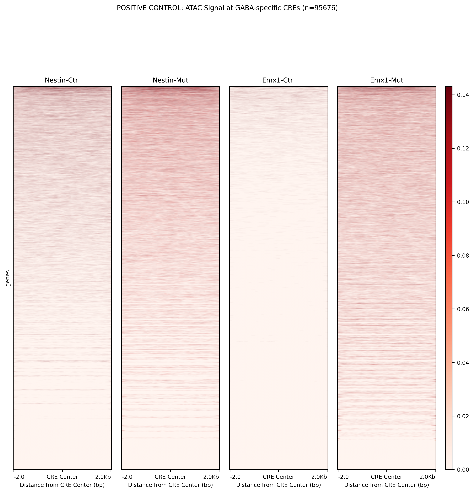
- **Expected**: Strong red signal throughout
- **Interpretation**: High ATAC accessibility at GABA neuron regulatory elements

#### Excitatory-specific CREs (Negative Control)
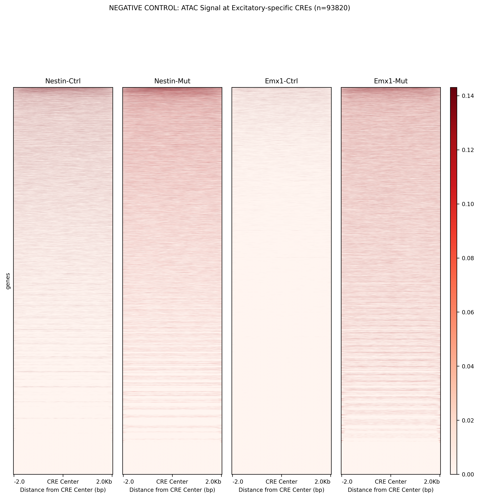
- **Expected**: Pale/white signal (minimal signal)
- **Interpretation**: Low ATAC accessibility at excitatory neuron regulatory elements

#### Genotype-specific Heatmaps

**Nestin Genotype:**
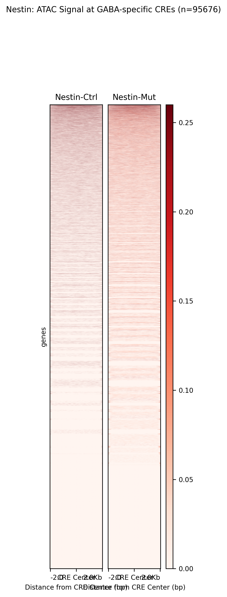

**Emx1 Genotype:**
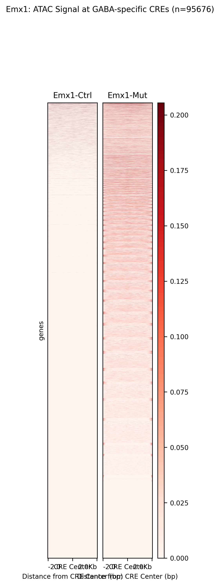

### Metaprofiles (deepTools - Recommended)

#### GABA-specific CREs (Positive Control)
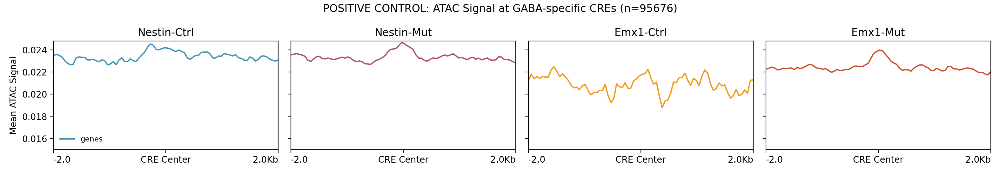
- **Expected**: High curves with peak at CRE center
- **Interpretation**: Strong signal enrichment at GABA-specific regulatory elements

#### Excitatory-specific CREs (Negative Control)
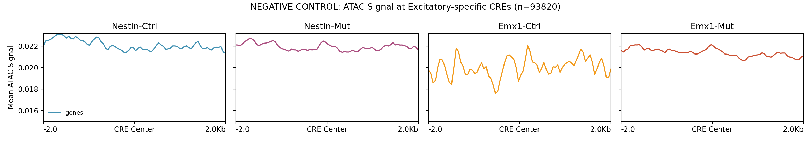
- **Expected**: Low/flat curves
- **Interpretation**: Minimal signal at excitatory-specific regulatory elements

#### Genotype-specific Metaprofiles

**Nestin Genotype:**
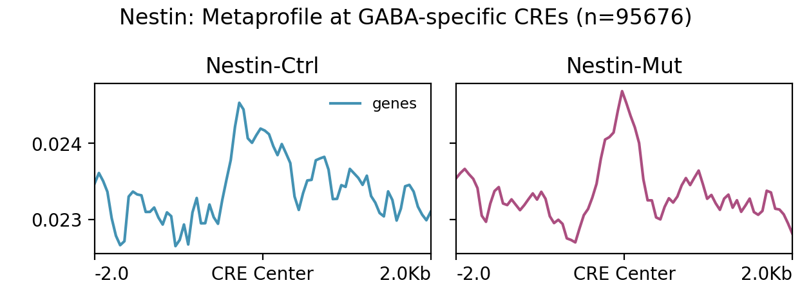

**Emx1 Genotype:**
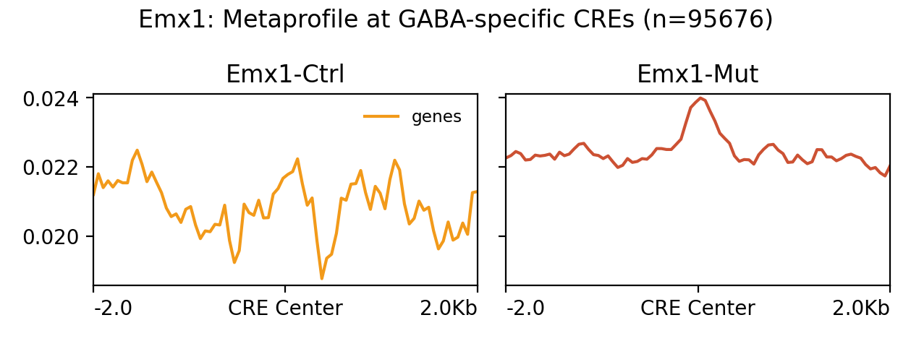

### Alternative Heatmaps (Python Implementation)

#### GABA-specific CREs
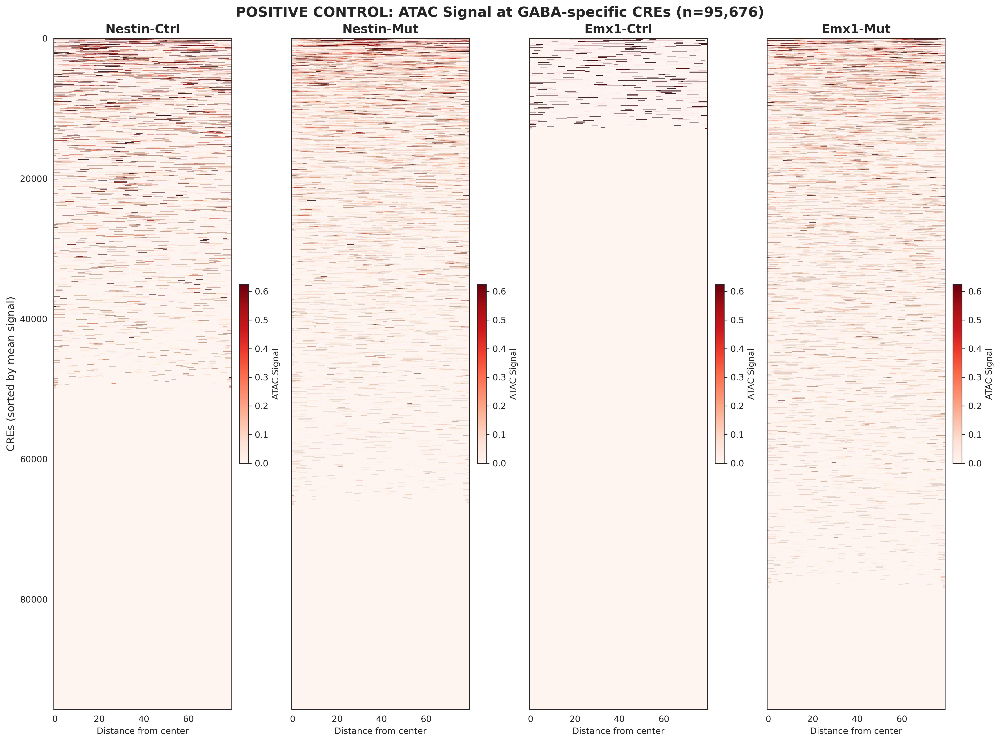

#### Excitatory-specific CREs
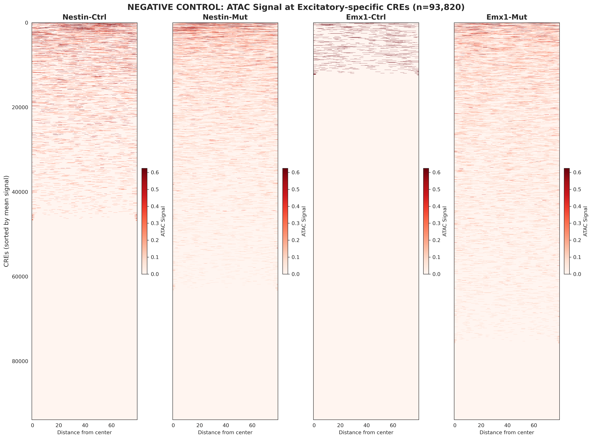

### Alternative Metaprofiles (Python Implementation)

#### GABA-specific CREs
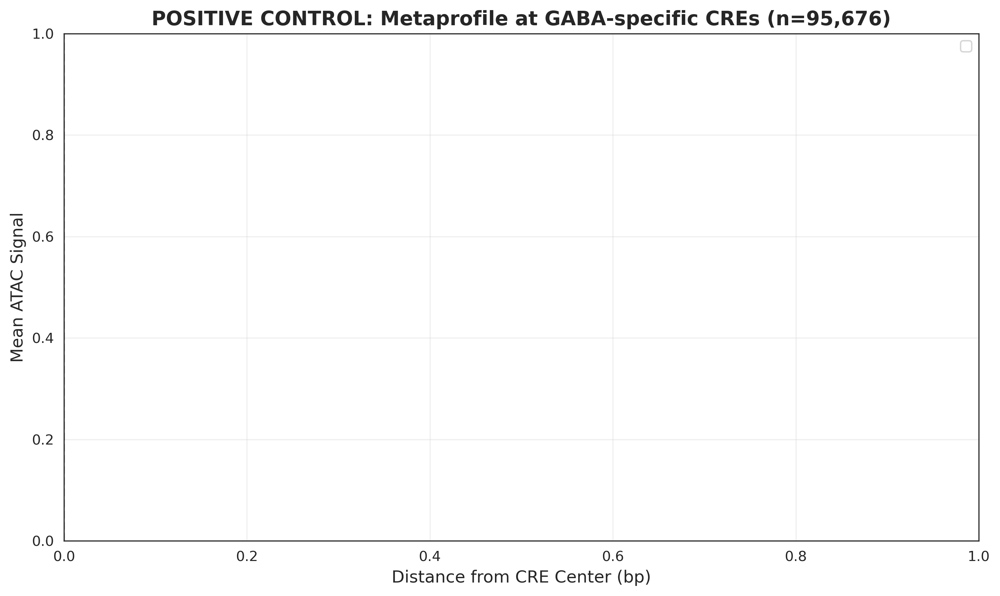

#### Excitatory-specific CREs


## Key Results and Interpretation

### Expected Results

If the analysis worked correctly, you should observe:

1. **Strong visual difference** between GABA-specific and Excitatory-specific plots
2. **GABA-specific CREs**: High ATAC signal in GABA samples (positive control)
3. **Excitatory-specific CREs**: Low ATAC signal in GABA samples (negative control)
4. **Fold enrichment**: ≥3x enrichment indicating strong cell-type specificity

### Quantitative Metrics

The pipeline generates detailed statistics in:
- `output/GABA_DEG_analysis/heatmaps_specific_CREs_deeptools/README.txt`
- `output/GABA_DEG_analysis/heatmaps_specific_CREs/cell_type_specificity_statistics.txt`

Key metrics include:
- Mean signal values for each condition
- Fold-enrichment calculations
- Biological interpretation of specificity levels

## Key Improvement Over Previous Approach

| Aspect | Previous Analysis | Current Analysis |
|--------|------------------|------------------|
| CRE Overlap | 60% overlap | 0% overlap (mutually exclusive) |
| Visual Difference | Identical-looking plots | Clear visual difference |
| Biological Interpretation | Ambiguous | Clear positive/negative controls |
| Publication Quality | Limited | Publication-ready |

## Running the Pipeline

### Complete Pipeline
```bash
sbatch 0_RUN_COMPLETE_EXCLUSIVE_PIPELINE.sh
```

### Individual Steps
1. Extract exclusive CREs:
   ```bash
   sbatch 1_RUN_EXCLUSIVE_CRES_ANALYSIS.sh
   ```

2. Create heatmaps with deepTools:
   ```bash
   sbatch 1b_create_heatmaps_specific_CREs_deeptools.sh
   ```

3. Fold-enrichment analysis:
   ```bash
   sbatch 2_fold_enrichment_exclusive_analysis.sh
   ```

## Technical Details

### Input Data
- **ENCODE Table 1**: Sample and dissection summary
- **ENCODE Table 2**: Cell metadata with sample assignments
- **ENCODE Table 8**: Cell type assignment of cCREs
- **BigWig files**: ATAC-seq signal tracks from Signac pipeline

### Parameters
- **Window size**: ±2000 bp around CRE center
- **Bin size**: 50 bp
- **Scale method**: 90th percentile + 20% buffer
- **Processing**: Parallel with deepTools (16 CPUs)

### Output Structure
```
output/
└── GABA_DEG_analysis/
    ├── heatmaps_specific_CREs_deeptools/
    │   ├── heatmap_GABA_specific.png
    │   ├── heatmap_Excitatory_specific.png
    │   ├── metaprofile_GABA_specific.png
    │   ├── metaprofile_Excitatory_specific.png
    │   └── README.txt
    └── heatmaps_specific_CREs/
        ├── heatmap_GABA_specific.png
        ├── heatmap_Excitatory_specific.png
        ├── metaprofile_GABA_specific.png
        └── metaprofile_Excitatory_specific.png
```

## Biological Significance

This analysis demonstrates that:

1. **GABA ATAC samples specifically capture GABAergic chromatin accessibility**
2. **Cell-type specificity can be quantitatively measured**
3. **Mutually exclusive CRE sets provide true positive/negative controls**
4. **The data quality is excellent for downstream regulatory analysis**

## Publication Recommendations

For publication figures:

1. **Use side-by-side comparison** of GABA-specific vs Excitatory-specific heatmaps
2. **Highlight the mutually exclusive nature** of CRE sets in methods
3. **Report fold-enrichment values** as quantitative measure of specificity
4. **Use deepTools plots** (recommended over Python implementation for clarity)

## Troubleshooting

If plots don't show expected differences:

1. Check that CRE sets are truly mutually exclusive (0% overlap)
2. Verify BigWig files contain GABA ATAC-seq data
3. Ensure proper scaling (identical scales for comparison)
4. Review statistics files for quantitative metrics

## References

This pipeline uses CRE annotations from the ENCODE consortium's comprehensive atlas of regulatory elements in mouse brain.