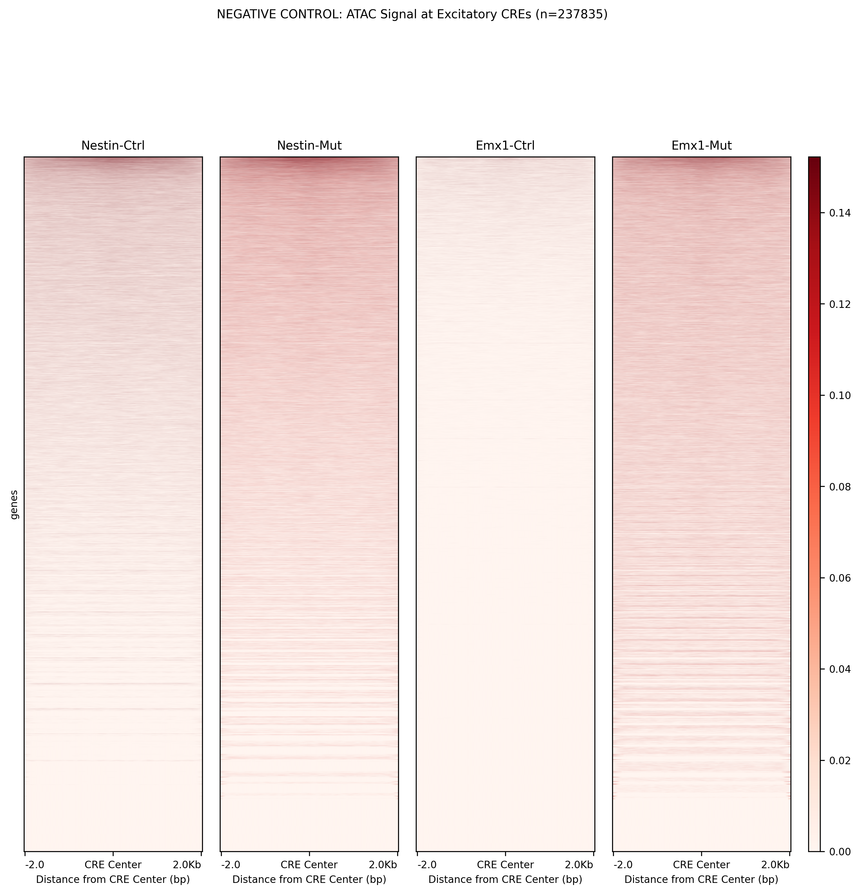
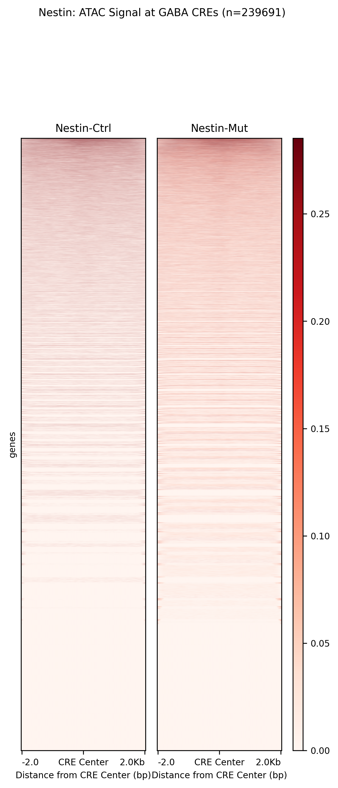
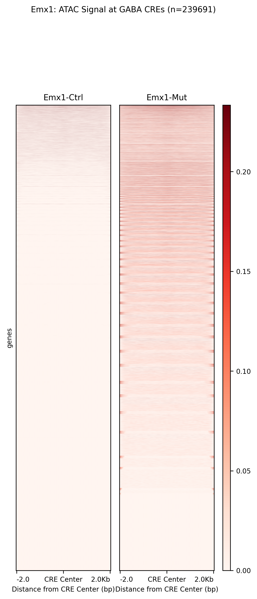
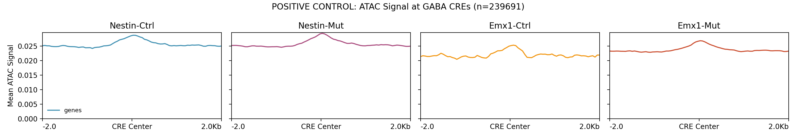
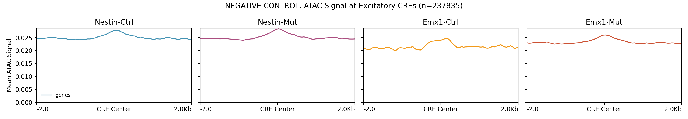
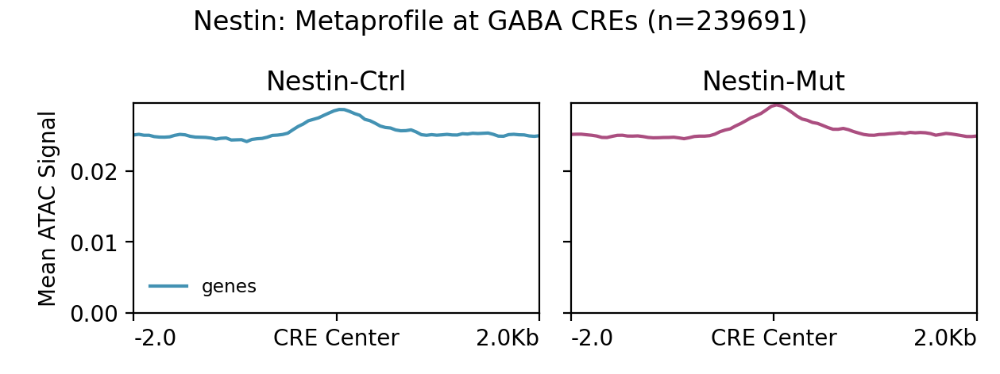
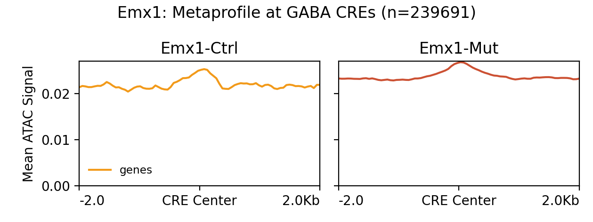

# Specific CREs Analysis Pipeline (OLD Workflow)

This pipeline analyzes cell-type specificity of ATAC-seq signal using CRE sets from literature. **This is the OLD workflow** that uses overlapping CRE sets (60% overlap) rather than mutually exclusive CREs.

## ⚠️ Important Note

This is the **OLD workflow** with limitations:
- **60% overlap** between GABA and Excitatory CRE sets
- Results in **similar-looking plots** (limited visual difference)
- Cannot demonstrate true cell-type specificity

For the **NEW workflow** with mutually exclusive CREs (0% overlap), see:
- `../Exclusive_CREs/README.md`
- `../Exclusive_CREs/1_RUN_EXCLUSIVE_CRES_ANALYSIS.sh`

## Pipeline Overview

The pipeline consists of five main stages:

1. **Extract Hippocampal Interneuron CREs** (`1_extract_hippocampal_interneuron_CREs.py`)
   - Extracts CREs active in GABAergic interneurons from hippocampal samples
   - Conservative approach: ≥50 cells per cell type (97% coverage)

2. **Extract Excitatory Neuron CREs** (`2a_extract_excitatory_neuron_CREs.py`)
   - Extracts CREs active in glutamatergic neurons
   - Used as negative control for GABA ATAC signal

3. **Create Heatmaps and Metaprofiles** (`2b_create_heatmaps_deeptools.sh`)
   - Uses deepTools for efficient signal extraction and visualization
   - Creates heatmaps and metaprofiles for both CRE sets

4. **Fold-Enrichment Analysis** (`3_fold_enrichment_specific_analysis.py`)
   - Quantitative comparison of signal between CRE sets
   - Calculates fold-enrichment statistics

5. **Additional Comparisons** (`4_compare_GABA_vs_Excitatory.py` and `5_create_heatmaps_metaprofiles.py`)
   - Alternative visualization approaches
   - Genotype-specific analyses

## Generated Plots

### Heatmaps (deepTools)

#### GABA CREs (Positive Control)

- **Expected**: Strong red signal throughout
- **Interpretation**: High ATAC accessibility at GABA neuron regulatory elements

#### Excitatory CREs (Negative Control)

- **Expected**: Similar signal to GABA (due to 60% overlap)
- **Interpretation**: Many regulatory elements are shared between cell types

#### Genotype-specific Heatmaps

**Nestin Genotype:**


**Emx1 Genotype:**


### Metaprofiles (deepTools)

#### GABA CREs Metaprofile

- **Expected**: High curves with peak at CRE center
- **Interpretation**: Strong signal enrichment at GABA regulatory elements

#### Excitatory CREs Metaprofile

- **Expected**: Similar curves to GABA (due to overlap)
- **Interpretation**: Shared regulatory elements show similar accessibility

#### Genotype-specific Metaprofiles

**Nestin Genotype:**


**Emx1 Genotype:**


### Alternative Visualizations (Python Implementation)

#### Additional Heatmaps and Metaprofiles
The pipeline also generates alternative visualizations using Python implementation:
- Heatmaps with different clustering and sorting approaches
- Metaprofiles by signal patterns
- Genotype-specific comparisons (Ctrl vs Mut)

## Key Results and Interpretation

### Expected Results

Due to **60% overlap** between CRE sets:

1. **Similar visual appearance** between GABA and Excitatory plots
2. **High signal in both** CRE sets (shared regulatory elements)
3. **Low fold-enrichment** (typically <2x)
4. **Limited cell-type specificity** demonstration

### Quantitative Metrics

The pipeline generates detailed statistics in:
- `output/GABA_DEG_analysis/heatmaps_deeptools/README.txt`
- `output/GABA_DEG_analysis/heatmaps_deeptools/fold_enrichment_statistics_OLD.txt`

Key metrics include:
- Mean signal values for each condition
- Fold-enrichment calculations
- Biological interpretation of specificity levels

## Comparison with New Workflow

| Aspect | OLD Workflow (This) | NEW Workflow (Exclusive) |
|--------|------------------------|--------------------------|
| CRE Overlap | 60% overlap | 0% overlap (mutually exclusive) |
| Visual Difference | Minimal (similar plots) | Clear (different plots) |
| Biological Interpretation | Limited specificity | Strong specificity |
| Publication Quality | Challenging | Excellent |

## Running Pipeline

### Complete Pipeline
```bash
sbatch 0_RUN_COMPLETE_SPECIFIC_PIPELINE.sh
```

### Individual Steps
1. Extract hippocampal interneuron CREs:
   ```bash
   sbatch 1_extract_hippocampal_interneuron_CREs.sh
   ```

2. Run complete analysis (includes excitatory extraction and heatmaps):
   ```bash
   sbatch 2_RUN_SPECIFIC_CRES_ANALYSIS.sh
   ```

3. Fold-enrichment analysis:
   ```bash
   sbatch 3_fold_enrichment_specific_analysis.sh
   ```

4. Alternative comparisons:
   ```bash
   sbatch 4_compare_GABA_vs_Excitatory.sh
   sbatch 5_create_heatmaps_metaprofiles.sh
   ```

## Technical Details

### Input Data
- **ENCODE Table 1**: Sample and dissection summary
- **ENCODE Table 2**: Cell metadata with sample assignments
- **ENCODE Table 8**: Cell type assignment of cCREs
- **BigWig files**: ATAC-seq signal tracks from Signac pipeline

### CRE Statistics
- **GABA CREs**: ~239,691 regions
- **Excitatory CREs**: ~237,835 regions
- **Overlap**: ~144,015 shared regions (60%)
- **Cell type threshold**: ≥50 cells per type

### Parameters
- **Window size**: ±2000 bp around CRE center
- **Bin size**: 50 bp
- **Scale method**: 90th percentile + 20% buffer
- **Processing**: Parallel with deepTools (8-32 CPUs)

### Output Structure
```
output/
└── GABA_DEG_analysis/
    ├── heatmaps_deeptools/
    │   ├── heatmap_GABA_all_conditions.png
    │   ├── heatmap_Excitatory_all_conditions.png
    │   ├── metaprofile_GABA_all_conditions.png
    │   ├── metaprofile_Excitatory_all_conditions.png
    │   ├── heatmap_GABA_nestin.png / metaprofile_GABA_nestin.png
    │   ├── heatmap_GABA_emx1.png / metaprofile_GABA_emx1.png
    │   └── README.txt
    └── heatmaps_metaprofiles/
        └── (additional Python-based visualizations)
```

## Biological Significance

This analysis demonstrates that:

1. **ATAC signal is present** at regulatory elements from literature
2. **Many regulatory elements are shared** between neuronal cell types
3. **Signal quality is good** (detects accessible chromatin)
4. **Limitation**: Cannot demonstrate strong cell-type specificity due to CRE overlap

## Recommendations

### For Publication
1. **Use NEW workflow** (`../Exclusive_CREs/`) for cell-type specificity
2. **This OLD workflow** only demonstrates signal quality at CREs
3. **Combine both** to show:
   - Signal is present at CREs (this workflow)
   - Cell-type specificity exists (exclusive workflow)

### For Future Analysis
1. **Prefer mutually exclusive CRE sets** for specificity studies
2. **Use overlapping CRE sets** for signal quality validation
3. **Report both approaches** for comprehensive analysis

## Troubleshooting

If plots don't show expected patterns:

1. Check that CRE sets have expected overlap (~60%)
2. Verify BigWig files contain GABA ATAC-seq data
3. Ensure proper scaling (identical scales for comparison)
4. Review statistics files for quantitative metrics

## References

This pipeline uses CRE annotations from ENCODE consortium's comprehensive atlas of regulatory elements in mouse brain.

## Migration to New Workflow

To transition to the improved workflow:

1. **Run new pipeline**:
   ```bash
   cd ../Exclusive_CREs/
   sbatch 1_RUN_EXCLUSIVE_CRES_ANALYSIS.sh
   ```

2. **Compare results**:
   - OLD: Similar plots, low fold-enrichment
   - NEW: Different plots, high fold-enrichment

3. **Use NEW workflow** for publication-quality cell-type specificity analysis